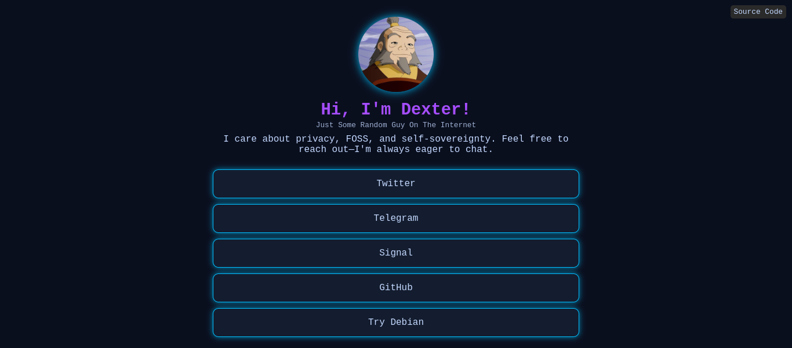

# d3x
A simple, static website.

## Preview

## Setup & Deployment
### Option 1: GitHub Pages
1. Fork this repository.
2. Go to **Settings > Pages**.
3. Under "Build and deployment," select **GitHub Actions** or **Deploy from a branch**.
4. Choose the `main` branch and save.
5. Your site will be live at `https://<your-username>.github.io/<repository-name>/`.

For full instructions, visit: [GitHub Pages Deployment Guide](https://docs.github.com/en/pages/getting-started-with-github-pages)

### Option 2: Other Static Hosting
This project is pure HTML/CSS/JS, so you can host it anywhere that serves static files:
- **[Netlify](https://www.netlify.com/)**
- **[Vercel](https://vercel.com/)**
- **Any Web Server** (Upload the files)

## Customization
- **Edit `index.html`** to change links, bio, and avatar.
- **Modify `style` in `index.html`** for design tweaks.

## License
No restrictions—use it, modify it, or adapt it as you wish.

---

Fast, simple, and yours to control.
